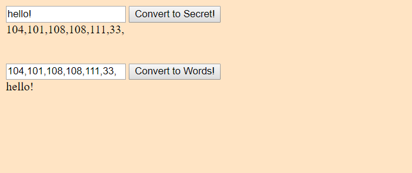

# code-maker-breaker
This project display when user input text into input field then it encodes to UTF-8 and when the user input encoding numbers into second input box, it convert back to words. 

# Screenshot
 coming soon....

## How to run this project
* Use npm to install http-server in your terminal:
```
npm install -g http-server
```
* Run the server
```
hs -p 9091
```
* Open chrome and navigate to :
```
localhost:9091
```
